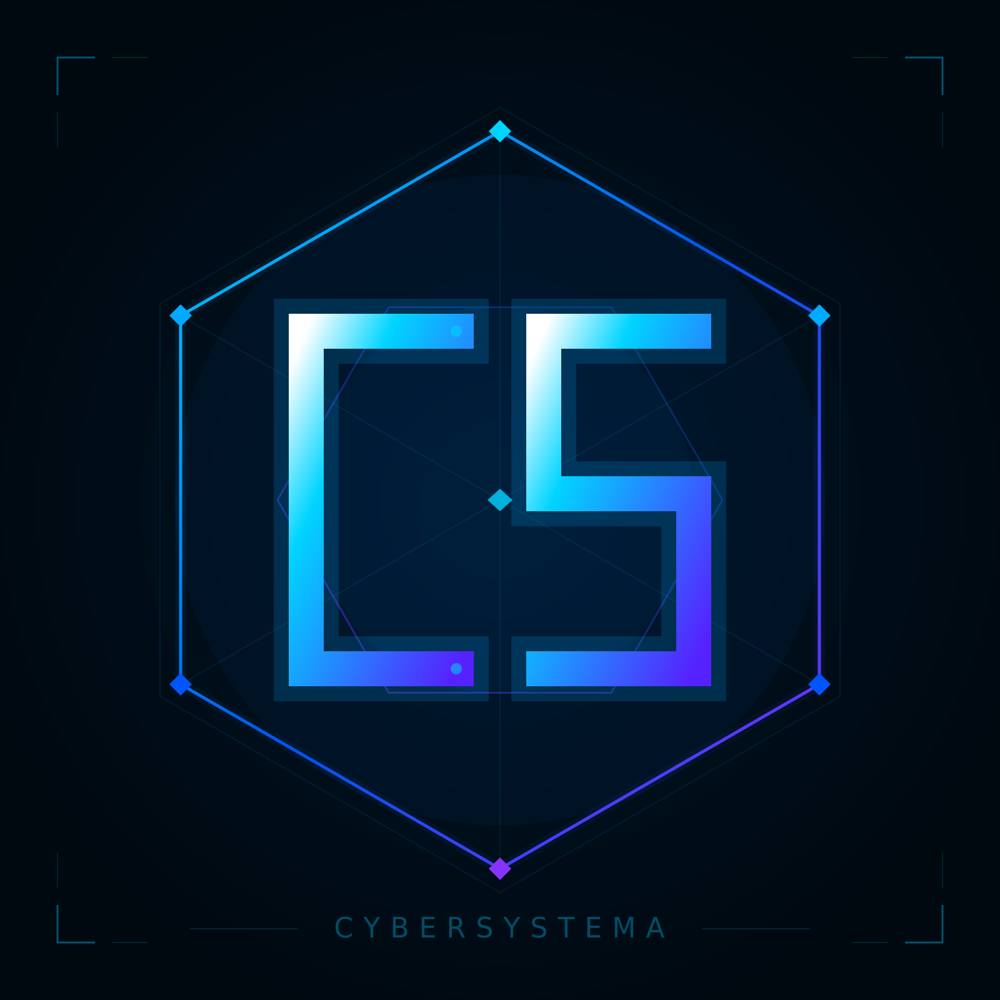

<div align="center">


<br>

# OKN Analytics

**Social media intelligence for the Orthodox Korea Network**

[](https://okn-analytics.pages.dev)
[](https://python.org)
[](https://github.com/CyberSystema/okn-analytics)

</div>

---

A Python pipeline that processes weekly CSV exports from **Instagram** and **TikTok**, runs **14 ML models** (including multilingual semantic AI for English, Korean & Greek), and generates a comprehensive HTML intelligence report — deployed automatically via GitHub Actions to Cloudflare Pages.

No APIs. No OAuth. No rate limits. Just data in, insights out.

## Features

- **Executive Summary** — plain-language weekly overview anyone on the team can read
- **Per-platform analysis** — Instagram and TikTok tracked separately with correct methodologies
- **14 ML & AI models** — from neural networks to multilingual semantic embeddings
- **Recency-weighted** — recent data matters more, older data fades out automatically
- **Trilingual NLP** — caption analysis across English, Korean (한국어) and Greek (Ελληνικά)
- **Historical tracking** — data accumulates weekly, models improve over time
- **Fully automated** — push CSVs → GitHub Actions → report deployed to Cloudflare Pages

## ML Models

<details>
<summary><strong>Core Models (1–10)</strong></summary>
<br>

| # | Model | Purpose |
|:---:|---|---|
| 1 | Feature Importance | Ranks what drives engagement |
| 2 | Neural Network Predictor | MLP (32→16→8) predicts engagement |
| 3 | Content Clustering | Groups posts into performance tiers |
| 4 | Anomaly Detection | Finds viral hits and flops |
| 5 | Caption NLP | Words/hashtags correlated with engagement |
| 6 | Engagement Drivers | Caption length, emoji, multilingual, timing |
| 7 | Content Fatigue | Detects declining engagement per content type |
| 8 | Optimal Cadence | Finds ideal posts/week |
| 9 | Momentum Score | Forward-looking health metric (0–100) |
| 10 | Root Cause Analysis | Explains WHY posts performed the way they did |

</details>

<details>
<summary><strong>Semantic AI Models (11–14)</strong> — powered by multilingual embeddings</summary>
<br>

Uses `paraphrase-multilingual-MiniLM-L12-v2` — understands English, Korean and Greek simultaneously.

| # | Model | Purpose |
|:---:|---|---|
| 11 | Topic Discovery | Clusters posts by meaning across all three languages |
| 12 | Similar Post Predictor | Predicts engagement based on similar past posts |
| 13 | Hashtag Cluster Strategy | Groups hashtags into semantic themes |
| 14 | Semantic Features | Caption embeddings as ML features for better predictions |

Gracefully skips if `sentence-transformers` is not installed.

</details>

## Quick Start

```bash
git clone https://github.com/CyberSystema/okn-analytics.git
cd okn-analytics
pip install -r requirements.txt
python scripts/main.py
```

### Dependencies

| Package | Purpose | Required |
|---|---|:---:|
| pandas, numpy, pyarrow | Data processing & history | ✅ |
| scikit-learn | ML models 1–10 | ✅ |
| matplotlib, stopwordsiso | Charts & trilingual NLP | ✅ |
| sentence-transformers | Semantic AI models 11–14 | Optional |
| prophet | Time series forecasting | Optional |

## Weekly Workflow

1. Export CSVs from **Meta Business Suite** (Instagram) and **TikTok Studio**
2. Rename Instagram content export to `content.csv`
3. Drop files in `data/instagram/` and `data/tiktok/`
4. `git add . && git commit -m "Week N data" && git push`
5. Report appears at [okn-analytics.pages.dev](https://okn-analytics.pages.dev) in ~2 minutes

The pipeline accumulates history — each week's data merges with all previous weeks and ML models improve as data grows.

## Project Structure

```
okn-analytics/
├── data/
│   ├── instagram/          ← Meta Business Suite CSV exports
│   └── tiktok/             ← TikTok Studio CSV exports
├── scripts/
│   ├── main.py             ← Pipeline orchestrator
│   ├── config.py           ← Configuration & branding
│   ├── ingest.py           ← Instagram data normalization
│   ├── ingest_tiktok.py    ← TikTok ingestion + Greek date parsing
│   ├── ingest_account.py   ← Account-level daily metrics
│   ├── analyze.py          ← Core analysis engine
│   ├── report.py           ← HTML report + executive summary
│   └── models/
│       ├── ml_engine.py    ← 14 ML models
│       ├── timing.py       ← Posting time optimization
│       ├── scoring.py      ← Content scoring
│       └── forecast.py     ← Growth forecasting
├── history/                ← Auto-managed (grows weekly)
├── reports/                ← Generated output
├── assets/                 ← Logos
└── .github/workflows/      ← CI/CD pipeline
```

## Configuration

All settings in `scripts/config.py`:

- **Timezone** — All times in KST. Instagram exports (PST) auto-converted.
- **Recency weights** — Last 90 days = full weight, 90–180 days = 0.3, older = 0.1
- **Branding** — OKN colors, logos, CyberSystema attribution
- **Thresholds** — Engagement benchmarks, viral multiplier, posting cadence targets

### GitHub Actions Secrets

| Secret | Description |
|---|---|
| `CLOUDFLARE_API_TOKEN` | Cloudflare Pages deploy token |
| `CLOUDFLARE_ACCOUNT_ID` | Cloudflare account ID |

## License

Internal tool for the Orthodox Korea Network.

---

<div align="center">

<a href="https://cybersystema.com">

</a>

<br>

Built by [Nikolaos Pinatsis](https://github.com/CyberSystema) · [cybersystema.com](https://cybersystema.com)

</div>
